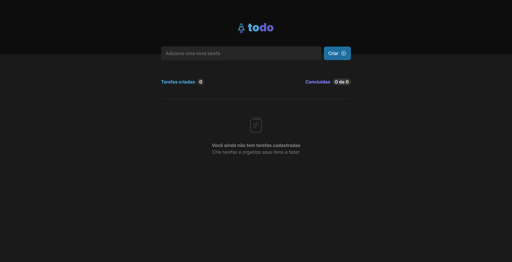

<h1 align="center">
    
</h1>

  

  

  

  

  

  

<h4 align="center">
  Ignite ToDo is a simple project that simulates the todo list.
</h4>

  <a href="#rocket-technologies">Technologies</a>&nbsp;&nbsp;&nbsp;|&nbsp;&nbsp;&nbsp;
  <a href="#memo-license">License</a>

  

## :rocket: Technologies

This project was developed using the following technologies:

- [yarn](https://vitejs.dev/)
- [vite js](https://vitejs.dev/)
- [react js](https://reactjs.org/)
- [typescript][ts]
- [tailwindcss](https://tailwindcss.com/)
- [phosphor-react](https://phosphoricons.com/)
- [VS Code][vscode] with [EditorConfig][vceditconfig] and [ESLint][vceslint]

## :memo: License

This project is under the MIT license. See the [LICENSE](https://github.com/lucianotavernard/ignite-todo/blob/master/LICENSE) for more information.

---

Made with ♥ by Luciano Tavernard :wave: [Get in touch!](https://www.linkedin.com/in/luciano-tavernard/)

[ts]: https://www.typescriptlang.org
[vscode]: https://code.visualstudio.com/
[yarn]: https://yarnpkg.com/
[vceditconfig]: https://marketplace.visualstudio.com/items?itemName=EditorConfig.EditorConfig
[vceslint]: https://marketplace.visualstudio.com/items?itemName=dbaeumer.vscode-eslint
